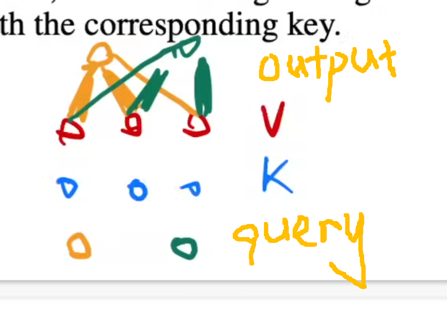

### 背景

两个比较主流的模型：

一个是language model，一个是当输出结构化信息比较多的时候使用的encoder-decoder architecture

传统RNN神经网络的问题：

1、RNN是时序性模型，对于一个序列的第t个状态$h_t$，它依赖于前一个隐藏状态$h_{t-1}$，所以该模型难以并行，计算上性能差

2、若时序比较长，后面也会丢失掉前面的信息，除非$h_t$比较大，但那会产生更大的内存开销

attention 在RNN上的应用，用在如何把编码器的信息有效地传给解码器

纯attention并行度比较高，这是transfomer的优势

## 相关工作

如何是应用CNN替换RNN

CNN对于长序列难以建模，每次只能看一个小窗口，如果两个像素隔得远，那么需要经过多层卷积，将这两个像素融合

transformer中的注意力机制可以一次性全看见

卷积比较好的地方是可以做多个输出通道，可以去识别不一样的模式

为了这个多输出通道，提出muti-headed attention，模拟多输出通道的效果

self-attention

memory network

第一个只依赖自注意力机制来实现encode-decode的模型

## 模型架构

transformer的模型架构图如下：

预测过程的流程图则如下：

.jpg)

.jpg)

编码器的输入是一段文本，假设有n个token，输出则是n个向量，向量维数在文中的例子是512

解码器拿到编码器的输出作为输入，输出一个不一样长的向量，自回归，只能一个一个生成，不像编码器是一次性看完所有

使用了残差链接（residual connection），残差连接的工作原理是在网络的一层或多层之间引入直接连接，使得这些层的输出不仅包括经过非线性变换的特征，还包括未经处理的输入特征。这样做的目的是允许网络学习到的是输入和输出之间的残差（即差异），而不是直接学习一个完整的映射，有助于梯度在训练过程中更有效地回流，减轻深度网络中梯度消失的问题
$$
LayerNorm(x+Sublayer(x))
$$

$$
d_{model} = 512
$$

batchnorm在训练的时候是小批量计算均值和方差，在预测的时候会把全局的均值和方差算出来存起来，在预测的时候使用

为什么用layernorm而不用batchnorm，因为seq的长度不一致，batchnorm计算的均值和方差抖动会比较大，还有另一个原因是如果算好了全局的均值和方差后，出现了一个超出训练数据中最长的数据的数据，那么之前算的就用不上了

## 注意力层
An attention function can be described as mapping a query and a set of key-value pairs to an output, where the query, keys, values, and output are all vectors. The output is computed as a weighted sum of values, where the weight assigned to each value is computed by a compatibility function（相似度） of the query with the corresponding key.

（不同的注意力机制，权重有不同的算法）

虽然key-value没有变，但是随着query的改变，因为权重的分配不一样，导致输出会不一样

不同的相似函数导致不一样的注意力版本，接下来讲的是transformer用到的版本

transformer的相似度是通过query和key做内积，除以它们的根号长度，再做一个softmax。由于是一个query和m个key做内积，那么将会得到m个权重，经过softmax的处理后，就变成了非负，权重和为1的权重分布，那么如果有n个query那就有：

最后那个矩阵的每一行都是这个函数的输出

### 多头注意力函数

上面讲到的情况是单头的情况，单头的问题在于，所包含的信息量，或者说泛化性还是不够的，与其进行一次attention映射，不如同时进行多次，那就是多头注意力的情况。

具体的实现方式是，将Q、K、V分别进行h个不同方向的投影，那么投影到的空间的维度就是原来维度的$1/h$，例如Q中每条query的维数是512，h=8，那么Q则会投影到8个不同的64维的空间上。这个投影方向是可以学习的，在不同的投影空间里面可以去匹配不同模式里它需要的相似函数。

然后再分别对这些投影后的矩阵进行单头注意力运算，得到的结果进行concat，再通过一次线性变换得到原来的维度。

其中$W^O$就是最后那个线性变换

## 注意力机制在transformer中的应用

自注意力机制就是说，最开始的Q、K、V都是同一个矩阵，都是输入矩阵它自己（可以理解为自己问自己问题，就可以结合上下文，去丰富每个单词在这个上下文中的语义），这就是编码器中的注意力模块和解码器中后一个注意力模块不同的地方。后者的K和V来自于编码器，而Q来自于解码器。

假设编码器的输出是n个d维向量（既作为key也作为value），解码器上一步的输出为m个d维向量（query），由于每一个query与K矩阵中的每一个key的内积会得到一组权重（这个内积可以理解为这条query去问每一个单词（key），意思是否相近，意思相近则内积结果大，对应其作为value的权重就大）而编码器输出的n个value以这组权重做一个加权和，得到的就是一条query的结果，而总共有m条query，所以输出为m个d维向量

### 多层感知器（MLP，Multiple Layer Perception）

在论文中，这个MLP被称为Position-wise Feed-Forward Networks，简称FFN

由于经过注意力机制后，每个单词都具备了序列信息，也就是都根据上下文丰富了自己的语义，那么FFN阶段，就可以单独地对这些单词进行处理了。

FFN层的目的主要是增强特征提取能力，此外，有研究表明FFN层还具有一定的记忆功能，这可能与它在模型中的位置和结构有关。

### Enbedding and Softmax

编码器、解码器，和最后softmax前的embedding，分享相同的权重，并且乘以一个$\sqrt{d_{model}}$，是为了后面的Position Encoding操作后，能使得每一个数字差不多在+1和-1之间

(这里暂时没看懂)

### Positional Encoding

由于单独的Attention模块的处理是不具备时序信息的，如果把一句话的单词前后顺序打乱，attention得到的结果还是一样的，只是向量的顺序不同，那么这肯定是有问题的，顺序不同按理来说单词的意思可能也会发生改变。

所以在Attention模块之前，加入了一个Positional Encoding模块，来加入时序信息

简单理解为，位置信息通过三角函数加到embedding里（两个512维的向量相加）